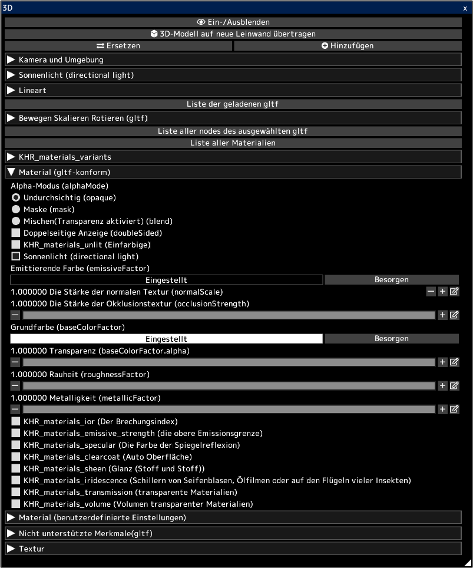

---
hide:
  - toc
---

<!-- https://steamcommunity.com/sharedfiles/filedetails/?id=2964323989 -->

Sie können 3D-Modelle in gltf- und glb-Dateien öffnen.  
Sie können das Aussehen von 3D unverändert auf die 2D-Leinwand übertragen.  
Sie können auch die Strichzeichnungen von 3D auf die 2D-Leinwand übertragen.  
Sie können die übertragene Leinwand verwenden, um Ihre Illustration zu erstellen. Verwenden Sie es beispielsweise als Hintergrund für eine Illustration.

3D-Modelle können in 3D-Software wie [blender](https://www.blender.org/) oder Autodesk Maya erstellt werden.  
Sie können auch 3D-Modelle von Websites wie [sketchfab](https://sketchfab.com/) herunterladen.

Durch Klicken auf die Schaltfläche __"Ersetzen"__ werden alle zuvor geladenen 3D-Modelle entfernt und es bleibt nur das neu geladene 3D-Modell übrig.  
Sie können ein 3D-Modell hinzufügen, indem Sie auf die Schaltfläche __"Hinzufügen"__ klicken.

Sie können ein gltf aus mehreren geladenen gltfs auswählen, indem Sie auf __"Liste der geladenen gltf"__ klicken.  
Sie können das ausgewählte gltf bewegen/rotieren/skalieren.

Sie können den nodes (Objekt) in der ausgewählten gltf auswählen, indem Sie auf __"Liste aller nodes des ausgewählten gltf"__ klicken.  
Sie können den ausgewählten nodes bewegen/rotieren/skalieren.

Sie können das Material in der ausgewählten gltf auswählen, indem Sie auf __"Liste aller Materialien"__ klicken.  
Sie können die Parameter des ausgewählten Materials anpassen.

Der Abschnitt __"Material (gltf-konform)"__ listet die Materialparameter gemäß der gltf-Spezifikation auf.  
3D-Modelle, die mit 3D-Software wie Blender erstellt wurden, spiegeln sich in den Parametern in diesem Element "Material (gltf-konform)" wider.  
[Überprüfen Sie diese Seite zum Speichern von gltf in blender.](https://docs.blender.org/manual/en/latest/addons/import_export/scene_gltf2.html#gltf-2-0)

3D-Modelle, die von Websites wie [sketchfab](https://sketchfab.com/) heruntergeladen wurden, sehen in sketchfab möglicherweise anders aus als in icpaint.  
In diesem Fall könnte die Aktivierung von KHR_materials_unlit (Einfarbige) das gleiche Aussehen ergeben.

* "Sonnenlicht (directional light)" wird beim Laden von gltf- oder glb-Dateien für alle Materialien aktiviert. Sie können das Kontrollkästchen "Sonnenlicht (directional light)" nach dem Importieren deaktivieren.
* Punktlichter und Spotlichter werden nicht unterstützt (point light, spot light) (KHR_lights_punctual)
* Die Animation von 3D Modellen wird nicht unterstützt.
* Beleuchtung durch Emittierende Farbe (emissiveFactor) etc. wird nicht unterstützt.
* Schattenwurf für 3D-Modelle wird nicht unterstützt.
* KHR_draco_mesh_compression, EXT_meshopt_compression, KHR_mesh_quantization werden nicht unterstützt.
* ktx2 (Bildformat) wird nicht unterstützt (KHR_texture_basisu)

[Auf dieser Seite erfahren Sie, wie Sie gltf mit einem Texteditor bearbeiten.](https://github.com/KhronosGroup/glTF-Tutorials/blob/master/AddingMaterialExtensions/AddingMaterialExtensions_002_UsingVisualStudioCode.md#using-visual-studio-code)

Die offiziellen Beschreibungen der Parameter im Abschnitt __"Material (gltf-konform)"__ lauten:

* [die Spezifikation von gltf](https://registry.khronos.org/glTF/specs/2.0/glTF-2.0.html)
* [Beschreibung von Alpha-Modus (alphaMode)](https://registry.khronos.org/glTF/specs/2.0/glTF-2.0.html#alpha-coverage)
* [Beschreibung von Doppelseitige Anzeige (doubleSided)](https://registry.khronos.org/glTF/specs/2.0/glTF-2.0.html#double-sided)
* [KHR_materials_unlit (Einfarbige)](https://github.com/KhronosGroup/glTF/tree/main/extensions/2.0/Khronos/KHR_materials_unlit#khr_materials_unlit)
* [grundlegende Beschreibung des Materials](https://github.com/KhronosGroup/glTF-Tutorials/blob/master/gltfTutorial/gltfTutorial_010_Materials.md#materials)
* [KHR_materials_ior (Der Brechungsindex)](https://github.com/KhronosGroup/glTF/tree/main/extensions/2.0/Khronos/KHR_materials_ior#khr_materials_ior)
* [KHR_materials_emissive_strength (die obere Emissionsgrenze)](https://github.com/KhronosGroup/glTF/tree/main/extensions/2.0/Khronos/KHR_materials_emissive_strength#khr_materials_emissive_strength)
* [KHR_materials_specular (Die Farbe der Spiegelreflexion)](https://github.com/KhronosGroup/glTF/tree/main/extensions/2.0/Khronos/KHR_materials_specular#khr_materials_specular)
* [KHR_materials_clearcoat (Auto Oberfläche)](https://github.com/KhronosGroup/glTF/tree/main/extensions/2.0/Khronos/KHR_materials_clearcoat#khr_materials_clearcoat)
* [KHR_materials_sheen (Glanz (Stoff und Stoff))](https://github.com/KhronosGroup/glTF/tree/main/extensions/2.0/Khronos/KHR_materials_sheen#khr_materials_sheen)
* [KHR_materials_iridescence (Schillern von Seifenblasen, Ölfilmen oder auf den Flügeln vieler Insekten)](https://github.com/KhronosGroup/glTF/tree/main/extensions/2.0/Khronos/KHR_materials_iridescence#khr_materials_iridescence)
* [KHR_materials_transmission (transparente Materialien)](https://github.com/KhronosGroup/glTF/tree/main/extensions/2.0/Khronos/KHR_materials_transmission#khr_materials_transmission-)
* [KHR_materials_volume (Volumen transparenter Materialien)](https://github.com/KhronosGroup/glTF/tree/main/extensions/2.0/Khronos/KHR_materials_volume#khr_materials_volume)
