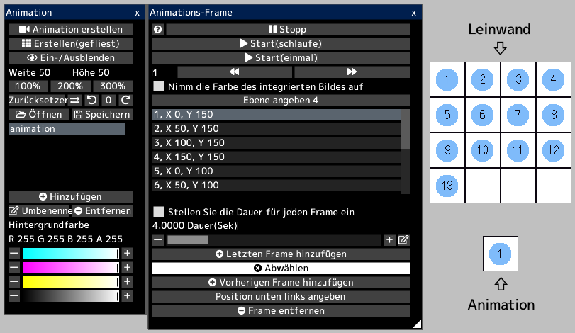
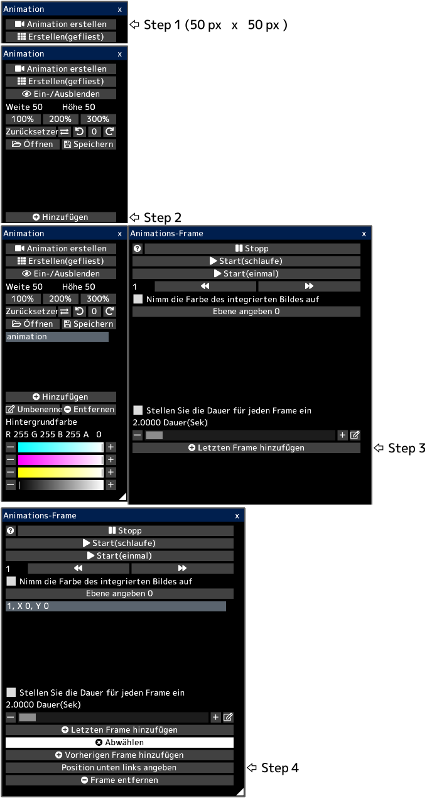
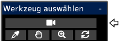

---
hide:
  - toc
---

<!-- https://steamcommunity.com/sharedfiles/filedetails/?id=2963170976 -->

Animation drückt Bewegung aus, indem Bilder für jeden Frame kontinuierlich gewechselt werden.

Jeder Frame ist ein bestimmter Bereich(Rechteck) auf der Leinwand.  
Alle Frames werden auf der Leinwand angezeigt.

Wenn Sie eine animierte gif- oder webp-Datei öffnen, wird die Leinwand mit der abspielbereiten Animation erstellt.  
Wenn die Leinwandgröße jedoch zu groß ist, wird keine Animation erstellt.

In dieser Leinwand ist beispielsweise jeder Frame der Animation ein quadratischer Bereich mit Zahlen von 1 bis 13.  
Wenn Sie die Animation abspielen, wird sie wie folgt abgespielt.

### So erstellen Sie Animationen

Erstellen Sie zunächst eine Leinwand, die so aussieht.  
Öffnen Sie als Nächstes das Fenster "Animation", indem Sie im Menü "Leinwand" auf die Schaltfläche "Animation-Fenster" klicken.

Sie erstellen 13 Frames.

Sie können die untere linke Position jedes Frames festlegen.  
__"1, X 0, Y 150"__ bedeutet, dass die untere linke Position des ersten Frames (0, 150) ist.  
Die Position unten links auf der Leinwand ist (0, 0).  
In diesem Beispiel hat jeder Frame eine Breite und Höhe von 50 px.  
Wenn ein Frame ausgewählt ist, wird ein blauer rechteckiger Rahmen auf der Leinwand angezeigt.

Wenn das Kontrollkästchen __"Nimm die Farbe des integrierten Bildes auf"__ aktiviert ist, wird die Animation mit der aktuellen Leinwand-Erscheinungsbild abgespielt.  
Wenn dieses Kontrollkästchen deaktiviert ist, wird die Animation nur mit dem Erscheinungsbild der angegebenen Ebene abgespielt.

Durch Klicken auf die Schaltfläche __"Start"__ wird die Animation abgespielt.  
Sie können die Position und Größe der abgespielten Animation ändern, indem Sie das Animationswerkzeug auswählen.

Sie können die Animation als gif- oder webp-Datei speichern.  
Da gif-Dateien eine begrenzte Anzahl von Farben haben, können Sie sie nur dann als gif-Datei speichern, wenn die Pixel-Art-Ebene ausgewählt ist.  
In diesem Fall müssen Sie die Animation in der Pixel-Art-Ebene zeichnen.
