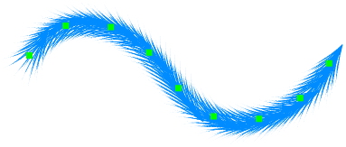

---
hide:
  - toc
---

<!-- https://steamcommunity.com/sharedfiles/filedetails/?id=2971124115 -->

Mit dem Werkzeug "Kurvenpinsel" können Sie Ihre Pinselstriche später ändern.  
Sie können Ihren Pinselstrich ändern, indem Sie auf Kontrollpunkte klicken und sie verschieben.  
Sie können auch die Pinselparameter ändern.

Indem Sie den Kontrollpunkt mit Shift + Klicken nach links/rechts bewegen, können Sie den Stiftdruck an der Position des Kontrollpunkts ändern.

|  | Wie verwenden |
| ------ | ----------- |
| Bewege den Kontrollpunkt       | Klicken und ziehen Sie den Kontrollpunkt |
| Ob der Kontrollpunkt eine scharfe oder eine glatte Kurve sein soll | Ctrl + klicken Sie auf den Kontrollpunkt |
| Verschieben Sie die Kurve, während Sie die Kurvenform beibehalten | Shift + Alt + klicken und ziehen |
| Drehen Sie die Kurve um die angeklickte Position | Ctrl + Shift + Alt + klicken und nach links oder rechts ziehen |

---

・ RGBA (0, 140, 255, 255)  
・ Weicher  
・ Abstand 20  
・ Größe 50  
・ Deckkraft 10%

---

・ RGBA (0, 140, 255, 255)  
・ Pinsel-Kreisbild (img.tga)  
・ Abstand 30  
・ Größe 35  
・ Deckkraft 100%  
・ Zufällige Winkel 179°

---

・ RGBA (0, 140, 255, 255)  
・ Pinsel-Kreisbild (fur.tga)  
・ Abstand 7  
・ Größe 30  
・ Deckkraft 100%  
・ Entlang des Pinselstrichs drehen

---

・ RGBA (255, 77, 77, 255)  
・ Hart  
・ Abstand 3  
・ Größe 9  
・ Deckkraft 100%

Dualer Pinsel

・ RGBA (104, 255, 172, 255)  
・ Weich  
・ Addieren(Glühen)  
・ Abstand 3  
・ Größe 8  
・ Deckkraft 80%

---

・ RGBA (0, 140, 255, 255)  
・ Pinsel-Kreisbild (splatter.tga)  
・ Abstand 35  
・ Größe 35  
・ Deckkraft 100%  
・ Zufällige Größe 120  
・ Zufällige Deckkraft 50%  
・ Zufällige Winkel 179°

---

・ RGBA (255, 0, 0, 255)  
・ Pinsel-Kreisbild (star.tga)  
・ Abstand 8  
・ Größe 10  
・ Deckkraft 100%  
・ Zufällige Größe 110  
・ Zufällige Position 250  
・ Zufällige Winkel 179°

Dualer Pinsel

・ RGBA (255, 255, 0, 255)  
・ Pinsel-Kreisbild (star.tga)  
・ Addieren(Glühen)  
・ Abstand 8  
・ Größe 7  
・ Deckkraft 100%  
・ Zufällige Größe 110  
・ Zufällige Position 250  
・ Zufällige Winkel 179°
