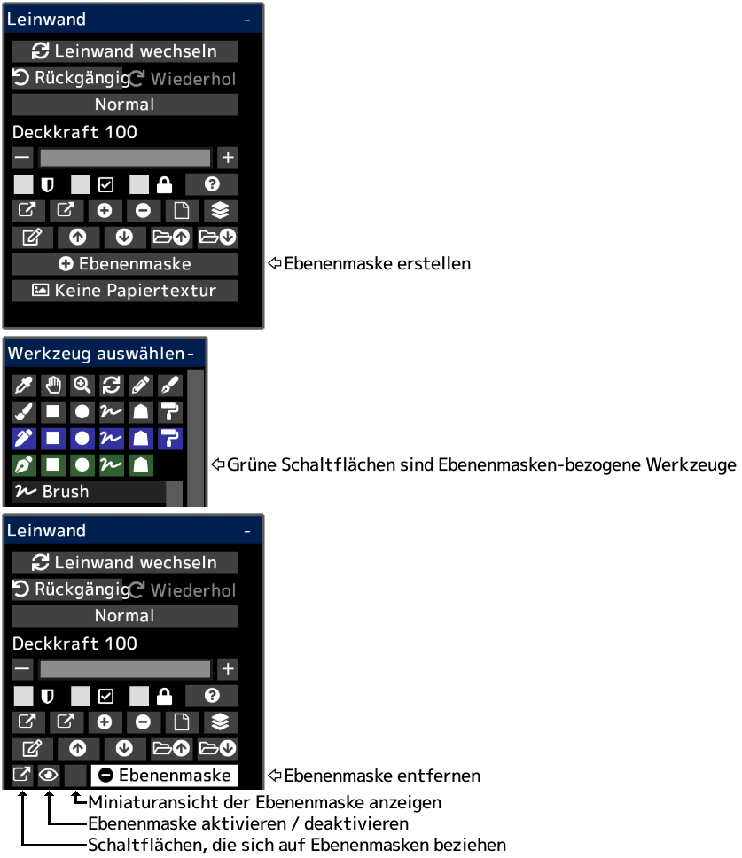

---
hide:
  - toc
---

<!-- https://steamcommunity.com/sharedfiles/filedetails/?id=2953906090 -->

Sie können den Zeichnungsinhalt teilweise ausblenden, indem Sie eine Ebenenmaske verwenden.  
Eine Ebenenmaske hat eine Deckkraft (0 ~ 255).  
Sie können auch eine Ebenenmaske für die Gruppe erstellen.  
Wenn Sie eine Ebenenmaske für die Einstellungsebene erstellen, können Sie den Teil anpassen, der von der Einstellungsebene beeinflusst werden soll.
