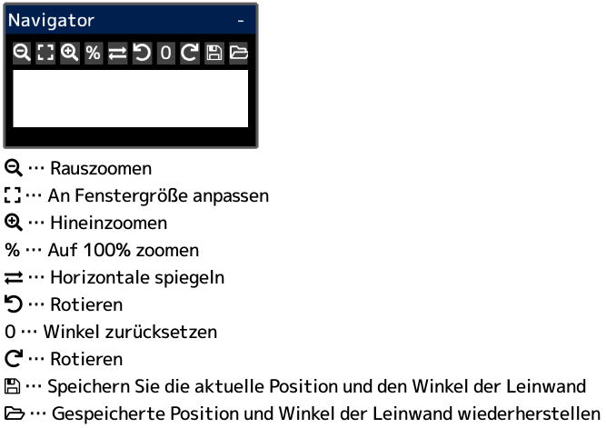

---
hide:
  - toc
---

<!-- https://steamcommunity.com/sharedfiles/filedetails/?id=2954722903 -->

Wenn Sie in das „Navigator“-Fenster klicken, bewegt sich die Leinwand so, dass die angeklickte Position die Mitte des App-Fensters ist.
