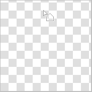

---
hide:
  - toc
---

<!-- https://steamcommunity.com/sharedfiles/filedetails/?id=2967687988 -->

Sie können das Werkzeug "Rechteck" auswählen, indem Sie im Fenster "Werkzeug auswählen" auf die Schaltfläche ■ klicken.

Beispiel zum Malen mit RGBA (44,134,245,150)

Beispiel einer Lackierung mit __"Abgerundete Ecken"__ aktiviert und auf 60 % eingestellt

Beispiel für das Malen mit aktiviertem __"Rahmen"__-Kontrollkästchen

Wenn Sie das Kontrollkästchen __"Seitenverhältnis"__ aktivieren, können Sie das Verhältnis von Höhe und Breite des Rechtecks festlegen.  
Wenn Sie das Kontrollkästchen __"px"__ aktivieren, können Sie die Höhe und Breite des Rechtecks in px-Einheiten angeben.

### Werkzeug "Kreis"

Beispiel zum Malen mit RGBA (44,134,245,150)

Beispiel für Malen mit ausgewähltem Optionsfeld "Weicher".

Beispiel für das Malen mit __"Ellipse"__ aktiviert und auf 40 eingestellt

Beispiel für Malen mit ausgewähltem Optionsfeld "Weicher".

### Werkzeug "Lasso"

Beispiel für Malen ohne Verwischen (RGBA (44,134,245,255))

Beispiel für Malen mit Verwischen 15x15 px (RGBA (44,134,245,150))

Beispiel für das Malen mit aktiviertem Kontrollkästchen __"Visualisierungsmodus"__ (Verwischen 3x3 px)

### Werkzeug "Vieleck"

Mit dem Werkzeug "Vieleck" wird die angeklickte Position zum Scheitelpunkt des Polygons.  
Sie können bis zu eins rückgängig machen.

---

Alle diese Malmethoden können auch im __"Mischmodus"__ gemalt werden.  
Sie können es zum Beispiel dunkler machen, indem Sie mit der Mischmodus "Multiplizieren" malen.  
Außerdem können Sie es zum Beispiel heller machen, indem Sie es im Mischmodus "Addieren(Glühen)" mit einem weißlichen Gelb bemalen.
