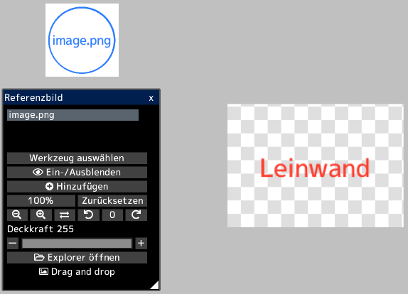
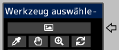

---
hide:
  - toc
---

<!-- https://steamcommunity.com/sharedfiles/filedetails/?id=2966628269 -->

Indem Sie das Bild im Fenster "Referenzbild" öffnen, können Sie das Bild getrennt von der Leinwand anzeigen.  
Sie können es als Referenz beim Erstellen von Illustrationen verwenden.

Sie können das Referenzbild frei verschieben, indem Sie auf die Schaltfläche __"Werkzeug auswählen"__ klicken.  
Im Fenster "Werkzeug auswählen" können Sie auch Werkzeuge für Referenzbilder auswählen.

