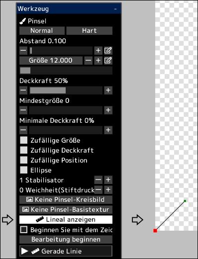

---
hide:
  - toc
---

<!-- https://steamcommunity.com/sharedfiles/filedetails/?id=2969761251 -->

Sie können Pinselstriche entlang des Lineals zeichnen.

Durch Klicken auf die Schaltfläche __"Lineal anzeigen"__ wird das Lineal an der unteren linken Position der Leinwand angezeigt.  
Dieses Lineal hat die gleiche Funktion wie Kurven in Vektorebenen.  
Der rote Punkt im Lineal ist der Anfangspunkt des Lineals.

Wenn __"Beginnen Sie mit dem Zeichnen am Anfangspunkt des Lineals(roter Punkt)"__ deaktiviert ist, beginnt der Pinselstrich am Punkt mit dem kürzesten Abstand zwischen der mit dem Pinsel berührten Position und dem Lineal.

Durch Klicken auf die Schaltfläche __"Bearbeitung beginnen"__ können Sie die Form des Lineals ändern.

|  | Wie verwenden |
| ------ | ----------- |
| Wählen Sie den Kontrollpunkt aus | Klicken Sie auf den Kontrollpunkt |
| Bewege den Kontrollpunkt         | Klicken und ziehen Sie den Kontrollpunkt |
| Löschen Sie den Kontrollpunkt    | Alt + klicken Sie auf den Kontrollpunkt |
| Ob der Kontrollpunkt eine scharfe oder eine glatte Kurve sein soll | Ctrl + klicken Sie auf den Kontrollpunkt |
| Fügen Sie am Ende der Kurve einen Kontrollpunkt hinzu | Klicken Sie irgendwo anders als auf den Kontrollpunkt |
| Fügen Sie einen Kontrollpunkt in der Mitte der Kurve hinzu | Klicken Sie irgendwo auf die Kurve |
| Fügen Sie am Ende der Kurve einen Kontrollpunkt (spitzer Winkel) hinzu | Ctrl + klicken Sie irgendwo anders als auf den Kontrollpunkt |
| Fügen Sie einen Kontrollpunkt (spitzer Winkel) in der Mitte der Kurve hinzu | Ctrl + klicken Sie irgendwo auf die Kurve |
| Verschieben Sie die Kurve, während Sie die Kurvenform beibehalten | Shift + Alt + klicken und ziehen |
| Bewegen Sie mehrere Kontrollpunkte gemeinsam | Shift + klicken und ziehen, um alle Kontrollpunkte innerhalb des Kreises zu verschieben |
| Skalieren Sie die Kurve | Ctrl + Alt + klicken und nach links oder rechts ziehen |
| Drehen Sie die Kurve um die angeklickte Position | Ctrl + Shift + Alt + klicken und nach links oder rechts ziehen |

Durch Klicken auf die Schaltfläche __"Bearbeitung beenden"__ können Sie wieder mit dem Pinsel zeichnen.
