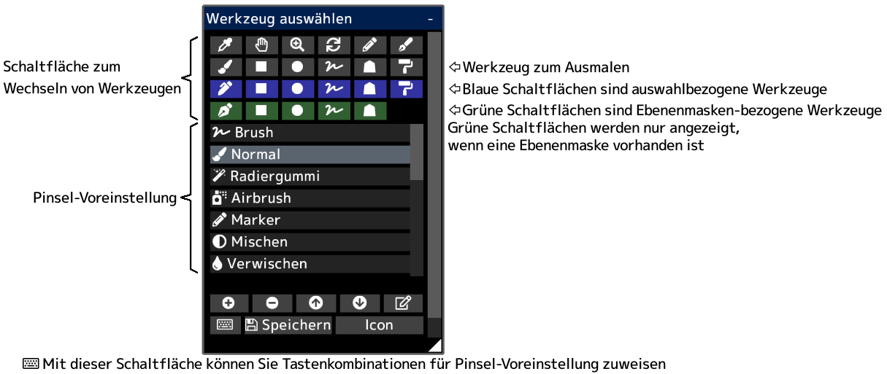

---
hide:
  - toc
---

<!-- https://steamcommunity.com/sharedfiles/filedetails/?id=2953784584 -->

Sie können die aktuellen Pinselvoreinstellungen speichern, indem Sie auf die Schaltfläche __"Speichern"__ klicken.  
Einstellungen für Auswahlpinsel, Ebenenmaskenpinsel und Kurvenpinsel werden gleichzeitig gespeichert.
