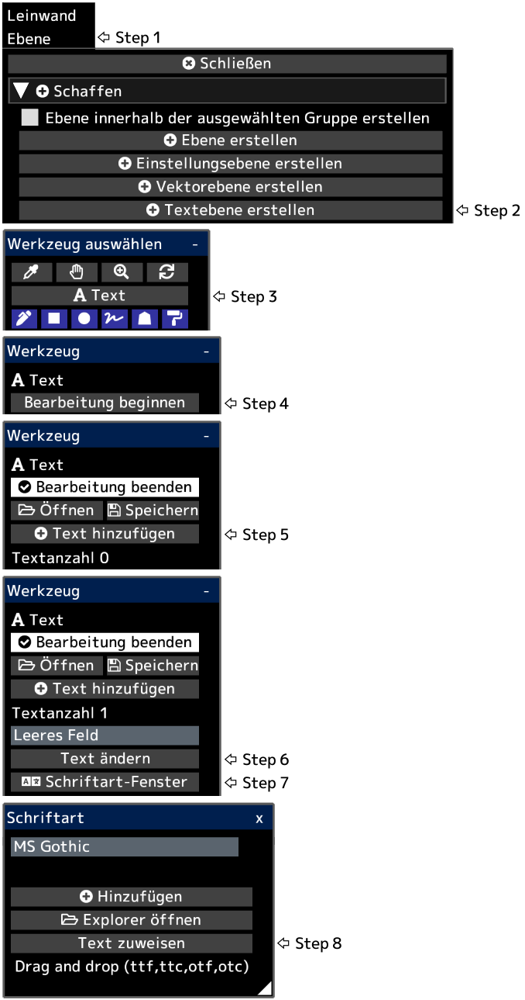

---
hide:
  - toc
---

<!-- https://steamcommunity.com/sharedfiles/filedetails/?id=2954855921 -->

Der Text wird an der unteren linken Position der Leinwand erstellt.  
Nachdem Sie auf __„Bearbeitung beenden“__ geklickt haben, werden die Deckkraft der Ebene, der Mischmodus, die Ebenenmaske usw. angewendet.

Sie können eine Textebene in eine Zeichenebene umwandeln, indem Sie im Menü „Ebene“ auf die Schaltfläche __„Ebene rastern“__ klicken.
