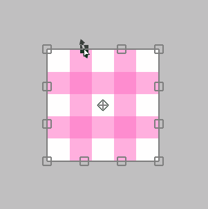

---
hide:
  - toc
---

<!-- https://steamcommunity.com/sharedfiles/filedetails/?id=2955721831 -->

### Wenn sich der Cursor im Transformationsbereich befindet

Sie können es durch Anklicken frei verschieben.

Sie können es mit Shift + Klicken nur horizontal oder nur vertikal verschieben.

### Wenn sich der Cursor außerhalb des Transformationsbereichs befindet

Sie können es drehen, indem Sie darauf klicken.

Sie können es um den Anker herum drehen, indem Sie Ctrl + Klicken drücken.

### Wenn sich der Cursor auf dem Anker befindet

Sie können nur den Anker durch Klicken verschieben.

### Wenn sich der Cursor am oberen, unteren, linken oder rechten Rand ( □ ) befindet

Sie können die Kante durch Klicken verschieben.

Sie können beide Seiten gleichzeitig verschieben, ohne die Mittelposition zu verschieben, indem Sie Alt + klicken.

Sie können die Kante durch Ctrl + Klicken frei verschieben.

Sie können die Kante mit Ctrl + Shift + Klicken entlang ihrer Richtung verschieben.

### Wenn sich der Cursor auf 4 Scheitelpunkten befindet ( □ )

Sie können den Scheitelpunkt verschieben, indem Sie darauf klicken.

Sie können es mit Alt + Klicken skalieren und drehen.

Sie können es durch Shift + Klicken gleichmäßig skalieren.

Sie können es gleichmäßig skalieren, ohne die Mittelposition zu verschieben, indem Sie Shift + Alt + Klicken verwenden.

---

Sie können nur den Scheitelpunkt durch Ctrl + Klicken frei verschieben.  
In diesem Fall ändert sich das Erscheinungsbild auf drei Arten.

#### Ctrl + Klick auf "Transformieren"

#### Strg + Klicken in "Perspektivische Transformation" mit deaktivierter "Perspektive"

#### Strg + Klicken in "Perspektivische Transformation" mit aktivierter "Perspektive"

Sie können zum Zustand vor der Transformation zurückkehren, indem Sie auf die Schaltfläche __"Zurücksetzen"__ klicken.

* Transformieren(Leinwandgröße)
* Bewegen Skalieren Rotieren(Leinwandgröße)
* Perspektivische Transformation
* Verflüssigen-Filter
* Retuschieren-Filter

Diese fünf Methoden können Transformationsinhalte speichern.  
Wenn sie gespeichert ist, können Sie dieselbe Transformation auf eine andere Ebene anwenden.

Wenn Sie durch Angabe eines numerischen Werts transformieren möchten, verwenden Sie bitte __"Bewegen Skalieren Rotieren"__.  
Zum Beispiel, wenn Sie es auf 50 % verkleinern oder um 45 Grad drehen möchten.
