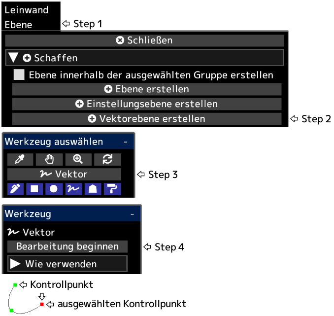

---
hide:
  - toc
---

<!-- https://steamcommunity.com/sharedfiles/filedetails/?id=2955215165 -->

Nachdem Sie auf __„Bearbeitung beenden“__ geklickt haben, werden die Deckkraft der Ebene, der Mischmodus, die Ebenenmaske usw. angewendet.

Sie können eine Vektorebene in eine Zeichenebene umwandeln, indem Sie im Menü „Ebene“ auf die Schaltfläche __„Ebene rastern“__ klicken.

|  | Wie verwenden |
| ------ | ----------- |
| Wählen Sie den Kontrollpunkt aus | Klicken Sie auf den Kontrollpunkt |
| Den Kontrollpunkt abwählen | Alt + klicken Sie irgendwo anders als auf den Kontrollpunkt |
| Bewege den Kontrollpunkt | Klicken und ziehen Sie den Kontrollpunkt |
| Löschen Sie den Kontrollpunkt | Alt + klicken Sie auf den Kontrollpunkt |
| Ob der Kontrollpunkt eine scharfe oder eine glatte Kurve sein soll | Ctrl + klicken Sie auf den Kontrollpunkt |
| Fügen Sie am Ende der Kurve einen Kontrollpunkt hinzu | Klicken Sie irgendwo anders als auf den Kontrollpunkt mit ausgewähltem Kontrollpunkt |
| Fügen Sie einen Kontrollpunkt in der Mitte der Kurve hinzu | Klicken Sie mit ausgewähltem Kontrollpunkt irgendwo auf die Kurve |
| Fügen Sie am Ende der Kurve einen Kontrollpunkt (spitzer Winkel) hinzu | Ctrl + klicken Sie irgendwo anders als auf den Kontrollpunkt mit ausgewähltem Kontrollpunkt |
| Fügen Sie einen Kontrollpunkt (spitzer Winkel) in der Mitte der Kurve hinzu | Ctrl + klicken Sie mit ausgewähltem Kontrollpunkt irgendwo auf die Kurve |
| Erstellen Sie einen Kontrollpunkt als weitere Kurve | Klicken Sie auf eine andere Stelle als den Kontrollpunkt, wenn kein Kontrollpunkt ausgewählt ist |
| Erstellen Sie einen Kontrollpunkt (spitzer Winkel) als weitere Kurve | Ctrl + klicken Sie auf eine andere Stelle als den Kontrollpunkt, wenn kein Kontrollpunkt ausgewählt ist |
| Löschen Sie die Kurve | Wiederholen Sie Alt + klicken Sie auf alle Kontrollpunkte oder klicken Sie auf die Schaltfläche "Kurve entfernen" |
| Verschieben Sie die Kurve, während Sie die Kurvenform beibehalten | Shift + Alt + klicken und ziehen mit ausgewähltem Kontrollpunkt |
| Duplizieren Sie die Kurve | Ctrl + Shift + klicken und ziehen mit ausgewähltem Kontrollpunkt |
| Bewegen Sie mehrere Kontrollpunkte gemeinsam | Shift + klicken und ziehen, um alle Kontrollpunkte innerhalb des Kreises zu verschieben |
| Skalieren Sie die Kurve | Ctrl + Alt + klicken und nach links oder rechts ziehen |
| Drehen Sie die Kurve um die angeklickte Position | Ctrl + Shift + Alt + klicken und nach links oder rechts ziehen |
